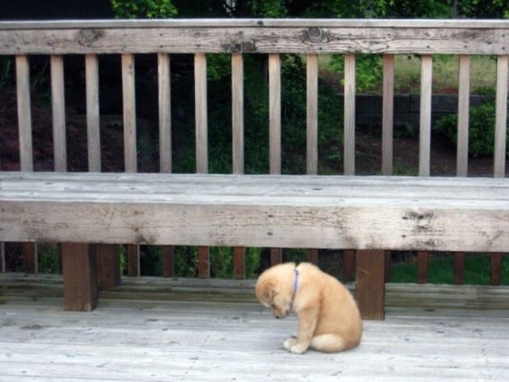

```{r setup, include=FALSE}
knitr::opts_chunk$set(echo = TRUE)
```

# Czego nauczymy się na tych warsztatach?

----

* Ściągania map google, nanoszenia punktów na te mapy 
* Znajdowania współrzędnych geograficznych miejscowości
* Tworzenia map z obszarmi wyodrębnionymi kolorem (*choropleth*)
* Zacznijmy naszą przygodę.

## Instalacja niezbędnych pakietów

```{r, eval = FALSE}
install.packages(c("dplyr", "ggplot2", "ggthemes", "ggmap"))
```

```{r, message=FALSE}
library(dplyr)
library(tidyr)
library(ggplot2)
library(ggmap)
library(ggthemes)
```

## Ściąganie mapy z google lub open street maps {.flexbox .vcenter}

```{r, cache = TRUE, message = FALSE}
wroclaw_mapa <- get_map(location = "wrocław", zoom = 10)
ggmap(wroclaw_mapa, extent = "normal")
```

---- {.flexbox .vcenter}

```{r, cache = TRUE, message=FALSE}
wroclaw_mapa <- get_map(location = c(17, 51.1), zoom = 12)
ggmap(wroclaw_mapa)
```

----

Jeśli nie będzie działało to trzeba zainstalować starszą wersję *ggplot2*.

```{r, eval = FALSE}
devtools::install_github("hadley/ggplot2@v2.2.0")
```


## Zaznaczanie punktów

Oznaczmy na mapie Wrocławia miejsca, w których odbywały się spotkania STWURa.

```{r, message=FALSE, cache = TRUE}
miejsca <- c("Wydział Biotechnologii, Wrocław", "Infopunkt Łokietka", "Wydział Matematyki PWr")
wspolrzedne <- geocode(miejsca)
miejsca <- cbind(miejsca, wspolrzedne)
miejsca$liczba_spotkan <- c(3, 1, 1)
```

Weżmy mapę, którą wcześniej ściągnęliśmy

---- 

```{r}
ggmap(wroclaw_mapa) +
  geom_point(data = miejsca, aes(x = lon, y = lat))
```

----

```{r}
ggmap(wroclaw_mapa) +
  geom_point(data = miejsca, aes(x = lon, y = lat, size = liczba_spotkan)) +
  theme_map()
```

----

```{r, cache = TRUE, message = FALSE}
wroclaw_mapa <- get_map(location = "wrocław", zoom = 13, maptype = "roadmap", color = "bw")
ggmap(wroclaw_mapa) +
  geom_point(data = miejsca, aes(x = lon, y = lat, color = miejsca, size = liczba_spotkan)) +
  theme_map() + scale_fill_discrete(name = "")
```

# Choreopleth

----

```{r rysunekPodregiony, echo = FALSE, out.width = "800px"}
knitr::include_graphics("wyksztalcenie_podregiony_w_czasie.png")
```

<!--
<div style="width:300px; height=200px">

</div>
-->

## Najpierw przetwarzamy dane

```{r wczytanieDaneInternet, cache = TRUE, warning = FALSE}
internet_dat <- read.csv(file = "data/internet_data.csv")
load("data/ksztalt_wojewodztw_data_frame.Rdata")

internet_podsumowanie <- internet_dat %>% 
  filter(rok == 2015) %>%
  group_by(wojewodztwo) %>%
  summarise(przecietnie_godzin_internetu = sum(waga*godzin_internetu)/sum(waga)) %>%
  mutate(wojewodztwo = tolower(wojewodztwo)) %>% 
  inner_join(wojewodztwa_nazwy_kody, by = c("wojewodztwo"="woj"))

plotData <- inner_join(Wojewodztwa, internet_podsumowanie, by = "id")
```

## Co się dzieje w kodzie powyżej krok po kroku

Filtrowanie obserwacji z roku 2015
```{r, eval = FALSE}
edu %>% 
  filter(rok == 2015) 
```

## Co się dzieje w kodzie powyżej krok po kroku

Policzenie procenta osób z wyższym wykształceniem w podziale na województwa
```{r, eval = FALSE}
group_by(wojewodztwo) %>%
  summarise(procent_wyzsze_wyksztalcenie = sum(waga[edukacja == 'wyższe i policealne'])/sum(waga)) 
```

## Co się dzieje w kodzie powyżej krok po kroku

Techniczne. Połączenie z data.frame *wojewodztwa_nazwy_kody*.

```{r, eval = FALSE}
mutate(wojewodztwo = tolower(wojewodztwo)) %>% 
  inner_join(wojewodztwa_nazwy_kody, by = c("wojewodztwo"="woj")) 
```

## Co się dzieje w kodzie powyżej krok po kroku

Połączenie z data.frame zwierającym definicje obszarów województw

```{r, eval = FALSE}
plotData <- inner_join(Wojewodztwa, edu_podsumowanie, by = "id")
```

# Wizualizacja

## Wizualizacja {.flexbox .vcenter}

```{r, fig.height = 4, fig.width = 6, warning = FALSE}
library(scales) #pretty breaks, percent
ggplot(data = plotData, mapping = aes(x = long, y = lat)) +
  geom_polygon(mapping = aes(group = group, fill = przecietnie_godzin_internetu))
```

---- {.flexbox .vcenter}



## Jak to naprawić?

```{r, fig.height=4, fig.width=5}
ggplot(data = plotData, mapping = aes(x = long, y = lat)) +
  geom_polygon(mapping = aes(group = group, fill = przecietnie_godzin_internetu)) +
  scale_fill_distiller("h", palette = "YlGn", breaks = pretty_breaks(n = 6),
                       trans = "reverse")
```

## Teraz technikalia:

```{r, eval = FALSE}
ggplot(data = plotData, mapping = aes(x = long, y = lat)) +
  geom_polygon(mapping = aes(group = group, fill = przecietnie_godzin_internetu)) +
  scale_fill_distiller("Godzin", palette = "YlGn", breaks = pretty_breaks(n = 6),
                       trans = "reverse") +
  guides(fill = guide_legend(reverse = TRUE)) +
  ggtitle(label = "Liczba godzin spędzanych tygodniowo w internecie", subtitle = "Średnia w podziale na województwa w 2015") + 
  theme_map(base_size = 18) +
  theme(plot.title = element_text(size = 24, hjust = 0.5, family = "mono"),
        plot.subtitle = element_text(size = 22, hjust = 0.5, family = "mono"),
        legend.position = "right",
        legend.key.height = unit(3, "cm"),
        legend.key.width = unit(1.5, "cm"))
```

* Usuwamy opisu osi
* Zmieniamy kolejność kolorów i wielkość legendy
* Dodajemy tytuł wykresu

----
```{r, echo = FALSE, fig.height=5.5, fig.width=8.5}
ggplot(data = plotData, mapping = aes(x = long, y = lat)) +
  geom_polygon(mapping = aes(group = group, fill = przecietnie_godzin_internetu)) +
  scale_fill_distiller("Godzin", palette = "YlGn", breaks = pretty_breaks(n = 6),
                       trans = "reverse") +
  guides(fill = guide_legend(reverse = TRUE)) +
  ggtitle(label = "Liczba godzin spędzanych tygodniowo w internecie", subtitle = "Średnia w podziale na województwa w 2015") + 
  theme_map(base_size = 18) +
  theme(plot.title = element_text(size = 20, hjust = 0.5, family = "mono"),
        plot.subtitle = element_text(size = 18, hjust = 0.5, family = "mono"),
        legend.position = "right",
        legend.key.height = unit(1.7, "cm"),
        legend.key.width = unit(1.1, "cm"))
```


